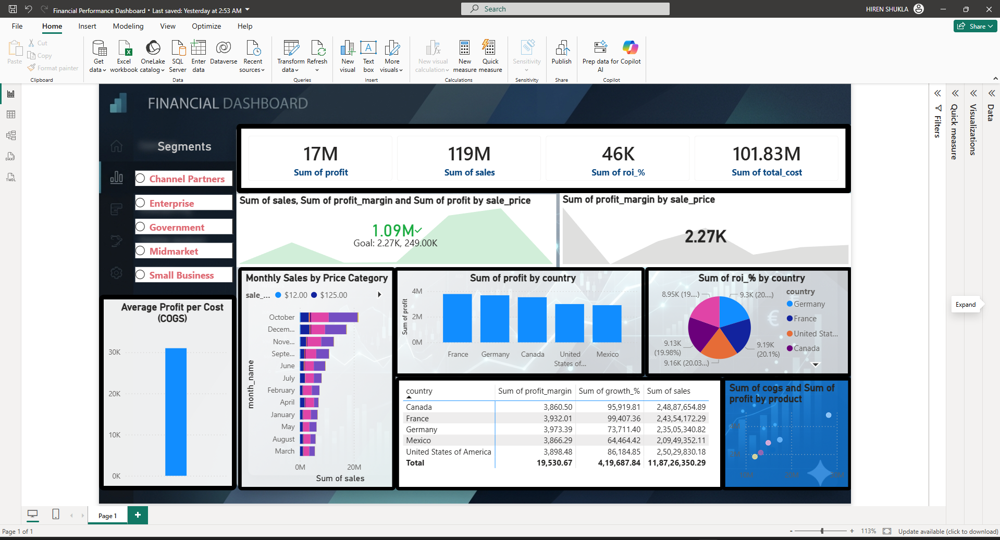

 📊 Financial Performance Dashboard (Power BI)

 📌 Project Overview
This project presents an interactive Financial Dashboard built using Power BI. It helps analyze sales, profit, cost, ROI, and growth across different countries and business segments.

---

🎯 Objectives
- Analyze financial performance
- Identify top-performing countries and segments
- Track profit, sales, and cost trends
- Provide business insights for decision-making

---

📂 Dataset
- Source: Sample Financial Data
- Fields:
  - Country
  - Segment
  - Product
  - Sales
  - Profit
  - Cost (COGS)
  - Profit Margin
  - Growth %

---

📊 Dashboard Features

🔹 KPIs
- Total Sales
- Total Profit
- Total Cost
- ROI %

🔹 Visualizations
- Sales by Month
- Profit by Country
- ROI by Country (Pie Chart)
- Profit vs Cost (Scatter Plot)
- Profit Margin Table

🔹 Filters
- Segment filter (Enterprise, Government, etc.)

---

📈 Key Insights
- Germany shows highest profit
- Enterprise segment performs best
- Some countries have high cost but low profit
- Seasonal trends observed in sales

---

🛠️ Tools Used
- Power BI
- DAX (Data Analysis Expressions)
- Excel / CSV

---

📷 Dashboard Preview

---

🚀 How to Use
1. Download `.pbix` file
2. Open in Power BI Desktop
3. Interact with filters and visuals

---

👨‍💻 Author
Hiren Shukla  
M.Tech Data Science Student  
